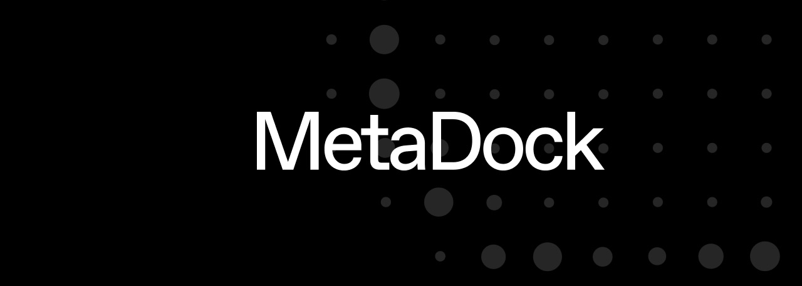

<h1 align="center">MetaDock Contracts</h1>

    <strong>Smart contracts built for the MetaDock platform.</strong>

    
     
    
    

    

MetaDock aims to offer a decentralised platform for freelancers and small companies to run all their operations
leveraging the power of web3 as an organisation.

## Architecture

Multiple Containers can be deployed, allowing ERC-20 and native tokens (ETH) to be deposited, acting as a user vault. At
the same time, a Container can execute arbitrary code on an unlimited number of Modules. This ability enhances the
MetaDock protocol with a modular architecture, providing an opportunity to create an open market of Modules where
external players can create and integrate their own use-cases into the protocol.

A module must first be allowlisted through the `ModuleKeeper` before being made publicly available to MetaDock users.
Currently, due to the high-security risks, only the MetaDock team can add modules to or remove them from the allowlist.

Once a module is allowlisted, it can be enabled via the `enableModule()` method available on any `Container`.

### Invoice Module

Our first available module is called `InvoiceModule`. This module enables users to create on-chain invoices that can be
paid using various methods, such as transfer,
[linear](https://docs.sablier.com/concepts/protocol/stream-types#lockup-linear) or
[tranched](https://docs.sablier.com/concepts/protocol/stream-types#lockup-tranched) stream, and have multiple payment
assets including any ERC-20 token and native ETH.

The `InvoiceModule` relies on the [Sablier V2](https://docs.sablier.com/concepts/what-is-sablier) protocol for stream
creation and management.

## Contribute

Anyone is welcomed to contribute either by creating & proposing a new module or simply
[opening](https://github.com/metadock/contracts/issues/new) an issue, starting a discussion or submitting a PR.

If you want to propose a new module, fork this repository and create a new folder inside the `src/modules/[module-name]`
folder following the `src/modules/invoice-module` module structure. Then, create a new PR with the module logic and a
detailed description of its capabilities.

## License

The primary license for MetaDock contracts is the GNU General Public License v3.0 (`GPL-3.0-or-later`),
see [LICENSE](https://github.com/metadock/contracts//blob/main/LICENSE). However, many files in `test/` are unlicensed.
